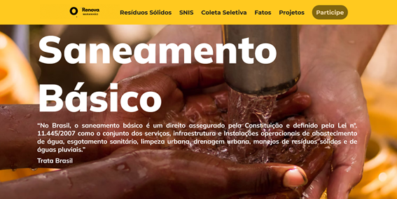

# RENOVA MARANHÃO

O Renova Maranhão é um projeto desenvolvido para o Programa Trilhas Inova Maranhão, que tem como desafio, a criação de uma Landing Page com dashboard, propondo soluções para problemas do estado do Maranhão. 🎮


## Visão geral🚮

A página visa informar os usuários sobre o manejo de resíduos sólidos no Maranhão, para que mais pessoas entendam e tenham uma visão geral da situação em que nosso estado se encontra. 🗑️




## Recursos📊


O Renova Maranhão disponibiliza uma variedade de gráficos que abordam questões sobre a coleta de lixo, reciclagem, unidades sem licença ambiental, onde o lixo é depositado, drenagem e aproveitamento de gases. Assim como informações a respeito do manejo de resíduos sólidos e como os usuários podem ajudar nessa questão. ♻️

## Colaboradores

Feito com ❤️ por essa equipe maravilhosa 

👋🏽 Entre em contato!

Quatro programadores 👨‍💻
* **[Jhones de Sousa](https://www.linkedin.com/in/jhones-de-sousa-soares-5229b41a6/)**
*    **[Kelvyn Reis](https://www.linkedin.com/in/kelvynreis/)**
*    **[Larissa Silva]()**
*    **[Neilton Seguins](https://www.linkedin.com/in/ne%C3%ADlton-seguins-bb8786a6/)**

Três designers 🎨
*    **[Lianna Ribeiro](https://www.linkedin.com/in/lianna-ribeiro-3366b9137/)**
*    **[Louise Araújo]()**
*    **[Maysa Mafra](https://www.linkedin.com/in/maysa-mafra-7a33bb146)**

Um analista de dados 📈
*    **[Railson Doglas ](https://www.linkedin.com/in/railsondoglas/)**


##  Layout🖌️

O layout do projeto pode ser acessado pelo [Figma](https://www.figma.com/) atravês desse [link](https://www.figma.com/file/H2OHmPQV5La2wILFpuMfTZ/Renova-Maranh%C3%A3o?node-id=58%3A2).

## Instalação🔧

### Dependencias
* [Git](https://git-scm.com/)

```bash
# Clone este repositório.
$ git clone https://github.com/KelvynReis/Renova-Maranhao.git

# Vá para a pasta Nlw-5-React.
$ cd Renova-Maranhao

# Instale as dependências (você pode rodar ele pela extensão do vscode "live server")

#Rode a aplicação
- Abrir o "index.html" com o live server

```

## Tecnologias utilizadas:

- Python
- Pandas
- Figma
- HTML
- CSS
- JavaScript

## Licença

- Copyright © 2021
- This project is [MIT](https://github.com/KelvynReis/Renova-Maranhao/blob/main/LICENSE.md) licensed.